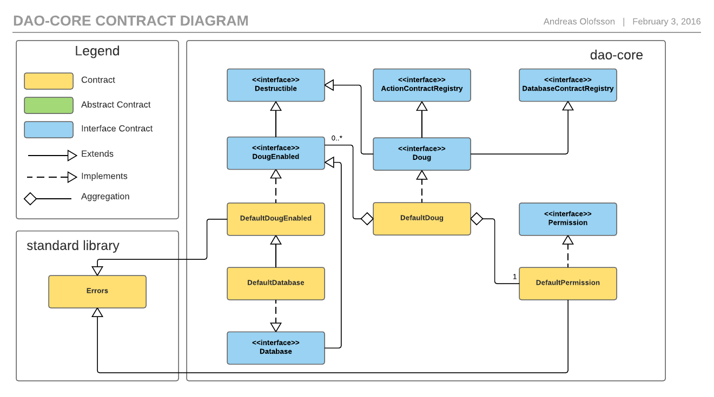

# dao-core

Dao-core is the centerpiece of the DAO framework.

## Installation and Usage

[User manual](https://github.com/smartcontractproduction/dao/blob/master/docs/Manual.md)

#### Deployment

Deployment to a running Ethereum chain can be done using `dao-core/script/bin/deploy_doug.js`.

It is possible to deploy Doug and run some calls as well, using `dao-core/script/bin/deploy_and_test_doug.js`
 
There will be more options later.

#### Building/rebuilding of contracts

NOTE: Requires `solc`.

Shell script: `$ ./build_contracts.sh dao-core`

Gulp: `$ gulp build:core`

### Contracts

#### Doug

Doug is the top level contract. It has a permissions contract, registries for actions and database contracts, and a number of basic options.

In the default implementation, the creator of Doug supplies the address to an already deployed `Permission` contract in the constructor. Doug will then use that to check if a caller is allowed to add, modify, or remove any of its contracts, or change the properties. By default it will also disallow everything if the permissions contract was not set.

The `Doug` contract itself is an interface, and `DefaultDoug` is the default implementation. 

#### DougEnabled

`DougEnabled` is an interface that contracts must implement in order to be added to Doug. There is also a default implementation named `DefaultDougEnabled`.
 
Note that this interface does not guarantee that a contract is safe to add, it just makes it easier for developers to create contracts that works with the system.

#### Permission

The permission contract is used to control access to Doug functionality, such as adding and removing contracts, and changing its options. It has an interface, `Permission` and a default implementation, `DefaultPermission`. Doug works with the interface, and the contract can be replaced by the user with (Doug) root permission, so it is possible to write a custom permission contract and use that instead.

#### Database

`Database` is an interface that extends `DougEnabled` and can be used by database contracts. It has a method that can be used to check caller addresses. There is a default implementation named `DefaultDatabase`, which extends `DefaultDougEnabled` and implements the method method by checking if the calling contract is registered as a Doug actions contract. 

The database contracts are is not required, but the default implementation can be useful when 