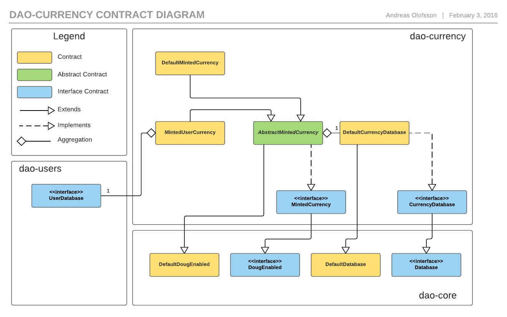

# dao-currency

## Installation and Usage

#### Building/rebuilding of contracts

NOTE: Requires `solc`.

Shell script: `$ ./build_contracts.sh dao-currency`

Gulp: `$ gulp build:currency`

#### Testing

Gulp: `$ gulp test:currency` 

Command-line tool: `$ solunit -d ./dao-currency/contracts/build/test`

#### Docs

Shell script: `$ ./build_docs.sh dao-currency`

Gulp: `$ gulp htmldoc:currency`

#### Usage

[User manual](https://github.com/smartcontractproduction/dao/blob/master/docs/Manual.md)

## Contracts

#### CurrencyDatabase

The currency database contract tracks the currency balance of accounts. It has methods for changing a balance and for transferring currency between accounts. There is an interface version, `CurrencyDatabase` and a default implementation, `DefaultCurrencyDatabase`. The default implementation uses a regular mapping rather then an iterable one, to save storage space, because a normal setup would include a user database with an iterable mapping so the caller might as well use that.

#### MintedCurrency

The actions contracts comes in the form of a minted currency. Users are allowed to send currency to each-other, but only the minter can create new coins. The `MintedCurrency` interface is partially implemented by `AbstractMintedCurrency`, which is the base class for minted currencies. There are two alternatives, `DefaultMintedCurrency` that comes only with the minter mechanics, and `MintedUserCurrency` that requires accounts that send or receive currency to be registered in a `UserDatabase` contract.