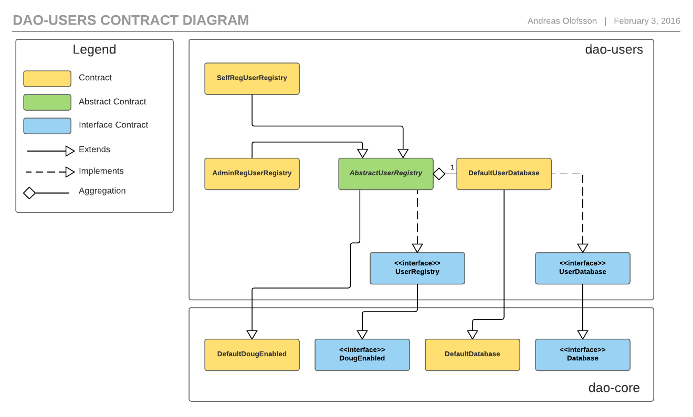

# dao-users

**Under construction**

## Installation and Usage

#### Building/rebuilding of contracts

NOTE: Requires `solc`.

Shell script: `$ ./build_contracts.sh dao-users`

Gulp: `$ gulp build:users`

#### Testing

Gulp: `$ gulp test:users` 

Command-line tool: `$ solunit -d ./dao-users/contracts/build/test`

#### Docs

Shell script: `$ ./build_docs.sh dao-users`

Gulp: `$ gulp htmldoc:users`

#### Usage

[User manual](https://github.com/smartcontractproduction/dao/blob/master/docs/Manual.md)

## Contracts

#### User database

The user database is for storing user data. A user in this system has three properties:

* nickname - a `bytes32` string.
* timestamp - a `uint` unix timestamp for when the user was added (normally `block.timestamp`).
* dataHash - a `bytes32` hash pointing to a file in some filesystem (IPFS, bittorrent, etc.)

The contents of the file that the hash points to is application specific, and could contain anything. Usually it would have the user e-mail address, phone numbers, etc. Things that isn't needed for any smart-contract logic.

This is a bare-bones user manager. If more user data is needed, such as reputation or a sub-currency/token balance, one should consider adding that in a separate module before hacking into this one. User data will usually change, and it might be worth keeping things separate.

There is an interface, `UserDatabase` and a default implementation, `DefaultUserDatabase`.

#### User actions

There are two actions contracts, `AdminRegUserRegistry` and `SelfRegUserRegistry` that both extend a third one, `AbstractUserRegistry`.

`AdminRegUserRegistry` only lets an admin add users. It can be useful when people must be identified before they may join.

`SelfRegUserRegistry` lets users register themselves.

Both registries has a single `admin` account that is allowed to remove users and modify their user data in both registries.

Both registries allows users to modify their user data and remove themselves.