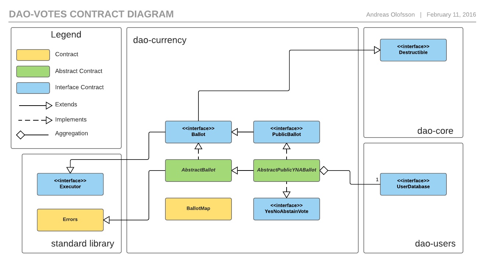

# dao-votes

**Under construction**

## Installation and Usage

#### Building/rebuilding of contracts

NOTE: Requires `solc`.

Shell script: `$ ./build_contracts.sh dao-votes`

Gulp: `$ gulp build:votes`

#### Testing

Gulp: `$ gulp test:votes` 

Command-line tool: `$ solunit -d ./dao-votes/contracts/build/test`

#### Docs

Shell script: `$ ./build_docs.sh dao-votes`

Gulp: `$ gulp htmldoc:votes`

#### Usage

[User manual](https://github.com/smartcontractproduction/dao/blob/master/docs/Manual.md)

## Contracts

#### PublicBallot

Public ballot is a complex ballot that allows everyone in entire user-registry to vote. It also has a time-limit, quorum, and other things. 

The ballot is a contract rather then just a struct in its manger, because of how much data it contains. If/when old ballots are removed, it is much easier to just call 'destroy' on a contract then manually removing potentially hundreds or thousands of mapped entries manually.
 
The `PublicBallot` contract is an interface, and there is also an abstract implementation name `AbstractPublicBallot`.

#### BallotMap

An iterable map that can be extended by ballot manager contracts.

#### PublicMintingBallot

A public ballot contract that will call a `mint` function on a given contract if the vote succeeds. The `mint` function is part of the `MintedCurrency` interface in `dao-currency`.

#### PublicCurrency

A minted user currency that Uses public voting for minting (through `PublicMintingBallot`).