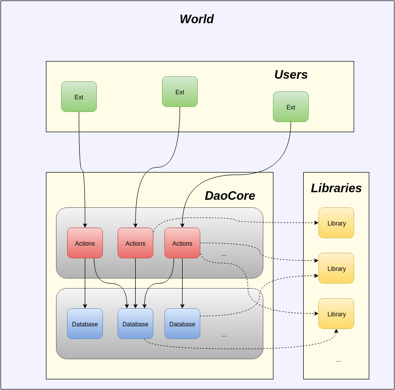

# DAO manual

## Table of Contents

1. [Overview](#overview)
2. [Getting started](#getting-started)
3. [Ðevelopment](#develop)
4. [Ðesign philosophy](#design)

## Overview



The DAO framework uses three main classes of contracts: Libraries, Databases and Actions.

#### Libraries

Libraries are plain Solidity libraries. These are not considered part of the system like databases and actions contracts because they are not registered with DaoCore, but they could be created together with the other contracts when a system is deployed.

#### Databases

Database contracts are bare-bones storage contracts. They contain only the functionality needed to read and write data to storage. The data they work with would usually be structured (though the actual struct definitions may be put in libraries), and they would usually have a collection interface, like a map or a set.

#### Actions contracts

Actions contracts contains a number of actions that can be taken by users. There could for example be a 'users' actions contract and a corresponding user database. The actions are functions in the actions contract and could do anything, like for example registering, modifying and removing users.

### DAO permissions model

There are three main types of access in this system:

1. **Root access**. This is managed by Doug, and handles permissions to add and remove contracts from the system, and changing core properties like whether or not contracts can be overwritten, and replacing the core premissions management system itself.

2. **Database access**. The system automatically gives actions-contracts write access to all the registered databases.
    
3. **User access**. This includes access to all actions except those that involves Doug. The application maker is in full control over these permissions. It could be handled per-contract or on a system wide basis (or both).

### Core contracts

These are the most important contracts in the core library (dao-core).

#### Doug

Doug is the top level contract. It has a permissions contract, registries for actions and database contracts, and a number of basic options.

In the default implementation, the creator of Doug supplies the address to an already deployed `Permission` contract in the constructor. Doug will then use that to check if a caller is allowed to add, modify, or remove any of its contracts, or change the properties. By default it will also disallow everything if the permissions contract was not set (i.e. the address is nil).

The `Doug` contract itself is an interface, and `DefaultDoug` is the default implementation. 

#### DougEnabled

`DougEnabled` is an interface that contracts must implement in order to be added to Doug.
 
Note that this interface does not guarantee that a contract is safe to add, it just makes it easier for developers to create contracts that works with the system.

#### Permission

The permission contract is used to control access to Doug functionality, such as adding and removing contracts, and changing its options. It has an interface, `Permission` and a default implementation, `DefaultPermission`. Doug works with the interface, and the contract can be replaced by the user with (Doug) root permission, so it is possible to write a custom permission contract and use that instead.

#### Database

`Database` is a contract that extends `DefaultDougEnabled` and adds an internal method for checking if the calling contract is registered as a Doug actions contract. It can be extended by contracts that are registered as databases in the system.

#### Errors

Errors is a contract with a number of error names and codes that is used in 'dao-core` functions (and its other modules).

NOTE: It is quite limited, and will hopefully be replaced with a more standardized one later. Also, it will be changed when constant variables can be declared outside of contracts, so that the contract doesn't have to be extended.

## Getting Started

TODO when new 

#### Next steps

The next step is to go through some of the [tutorials](https://github.com/smartcontractproduction/dao/blob/master/docs/Tutorials.md).

<a name="develop"></a>
## Ðevelopment

This section contains a more detailed description, for developers.

TODO


<a name="design"></a>
## Ðesign philosophy

The purpose of the dao-core is to provide a solid base for advanced systems of Ethereum contracts. The goal is to make the system:

- Efficient. Should not add extra database bloat or slow things down unnecessarily.

- Flexible. You should be able to replace components when they become outdated, or bugs are discovered.

- Reliable. The system should be secure, which means it should be protected against attacks as well as mistakes made by users and developers.

Striking a good balance can be difficult, as it is in all types of programs. It requires some insight into how the gas system, contract-calling, and the database works.

**Gas**

Gas is used to pay for both processing power and database storage on the public Ethereum chain, because every full node has to execute all transactions, and store all the data. The gas cost for each VM instruction can be found in the table on page 20 of the [Ethereum Yellow Paper](http://gavwood.com/paper.pdf).

It's worth noting that as of 2016-01-10, simple operations (push to stack, add, multiply, etc.) costs 1 single gas, but writing one word (up to 32 bytes of data) costs 20000. This means contract optimization can be summed up by two words - **AVOID STORAGE**. Things you can do is to avoid collections that requires extra data per element, instantiating new contracts, and if a function stores user data it should normally be careful with un-bounded strings and arrays.

**Contract calling**

Contracts that has been added to the Ethereum chain can be transacted to by anyone, which means that anyone can invoke the functions they expose. If a function invocation involves write operations you will normally start by checking if the caller has the permission to run it. This could be done for example by pre-registering an account as the administrator (or owner), and then check if the caller is that account. This is an example:
 

``` javascript
contract SelfDestructible {
    
    address _owner;
    
    function SelfDestructible(address owner) {
        _owner = owner;
    }
    
    function destroy() {
        if (msg.sender == _owner) selfdestruct(_owner);
    }
    
}

contract IncrediblyUseful is SelfDestructible {
    
    function IncrediblyUseful() SelfDestructible(msg.sender) {}
    
}
```

In this case, a contract that extends `SelfDestructible` will have a `destroy` function for self destruction. This function is public, and can be invoked by anyone, but unless their address is the same as `owner`, it will not pass the guard and nothing will happen. For example, in the  `IncrediblyUseful` contract (which can do nothing but self-destruct), the owner would always be the account that created the contract.

**The database**

Ethereum contracts have access to a database so that they can persist the values of their fields between calls. The big problem is that the storage of a particular contract can only be accessed by the code in that contract, and that code is immutable. If there are bugs in the code, or you need to add new functionality, you can't just update it, restart, and keep going; you have to create an entirely new contract. The old contract will still have the data in it though, and you still have to go through the old code to make changes to that data.

The reason for this is that it allows for trust-less systems. If the code is immutable, and the rules are set in advance, then it is possible to create contracts that can be called by anyone without them having to worry about any changes. This is great for oracles and other things.

The purpose of the database and actions contract separation is to work around this limitation. Certain contracts have to be managed, for example those that involve transfers of valuable assets, where users has to know that the actions they and others take are legally binding.

Database contracts would normally work like very basic collections and provide an interface for reading, writing and modifying the data. Additionally, they only need to do one simple check to see if the caller has the right permission. Admittedly it will cost a bit more gas then when everything is lumped together into one contract, but the cost is in most cases negligible (a few hundred gas).

It's worth pointing out that a lot of the difficulties with contracts doesn't come with basic usage. "I can test my contract to see if it works, why would it all over sudden break???". That is a bad question, because most contracts that are part of a system will depend on other contracts - most importantly the ones that handles account permissions - and some would likely be replaceable. A user calling a contract will often lead to a series of intra-system contract-to-contract calls. Changing one of those contract could have effects on the others, and those effects could sometimes be hard to predict; some could even be irreversible.

#### Avoiding complexity

The DAO framework has a clear separation between its different components. The `dao-core` library, for example, requires only two contracts to be deployed, Doug and Permission, because that's all it needs.

This I believe encourages developers (including myself) to write modular code, like they would in any other language.

#### A note on public and private chains

The dao-core is designed with public chains in mind, but not the public Ethereum chain. This is mostly due to gas. The purpose of the gas system is to regulate the public Ethereum chain, and in practice it only allow trivial systems because of how restrictive it is. At least for now. An application-specific side-chain would have fewer contracts in it and less data to store, meaning it could have lower gas costs and a higher max limit in blocks. 

When it comes to private chains, i.e. chains that are managed by a single entity that does all the validation, I don't think there is a strong use case for the dao framework. If the chain is private and application specific, the proprietor might as well include the smart-contract logic in the client itself and save themselves all of the EVM overhead (and having to work in a new and somewhat difficult language). The usefulness of private chains (if any) is still being debated, and lots of research is going on, but I can't see any good use-case other then experimentation, or to prepare before the system is eventually put on a public (or some kind of semi-public) chain.

For these reasons, the dao framework may evolve into two different versions; one for big systems, and a hyper-optimized mini version for the public Ethereum chain.
