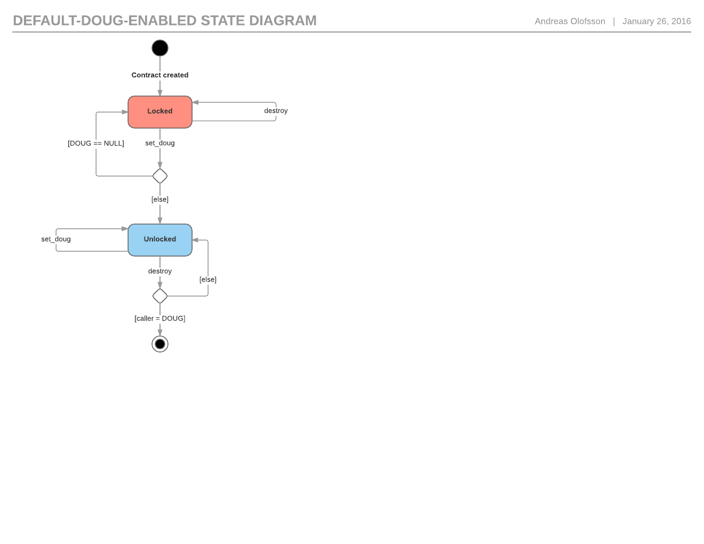

# Permission Analysis

This is a brief description of the analysis used to check if the framework (and systems of contracts in general) is intact. It will be formalized later.

The reader must be familiar with the [Ethereum protocol](https://github.com/ethereum/wiki/wiki/White-Paper), and the [Solidity language](http://solidity.readthedocs.org/).

## Table of content

* [Introduction to Contracts and Account Permissions](#introduction-to-contracts-and-account-permissions)
* [Systems of contracts](#systems-of-contracts)
* [The DAO Framework](#the-dao-framework)

## Introduction to Contracts and Account Permissions

The framework uses a system of account permissions for restricting access to actions such as adding and removing contracts from the system, destroying contracts, adding new users, and mint coins. A simple example is the `DefaultDougEnabled` contract:

```
contract DefaultDougEnabled is DougEnabled {

    Doug _DOUG;

    function setDougAddress(address dougAddr) returns (bool result) {
        if (dougAddr == 0)
            return false;
        if(address(_DOUG) != 0x0 && address(_DOUG) != msg.sender)
            return false;
        _DOUG = Doug(dougAddr);
        return true;
    }

    function dougAddress() constant returns (address dougAddress) {
        return _DOUG;
    }

    function destroy(address fundReceiver) {
        if (msg.sender == address(_DOUG))
            selfdestruct(fundReceiver);
    }

}
```

As can be seen there is a `_DOUG` field in the contract which stores an account address. There is also a guard in the `destroy` function that checks if the calling account is the same as `_DOUG`. This is a very common form of permission in Ethereum contracts: 

1. An account address is stored in a contract.
2. When a function is called, it will check if the address of the calling account is equal to that address. If not, the function will return to prevent the code from being run.

The permission can be implemented in many different ways; for example, there could be a check against a collection of addresses rather then just one, or it could be based on some other property of the calling accounts, but everything is fine so long as it divides accounts up into two distinct classes - those that are allowed to call the function and those that are not. The `DefaultPermission` contract in `dao-core` is an example of a more advanced account permission handler; it is an entire contract that stores a root user account, a set of owners, and has functions for adding and removing addresses, and checking whether or not an address is registered.

Finally, contract accounts and user (external) accounts both have addresses, and there is no distinction between them. In the `DefaultDougEnabled` contract, `_DOUG` could be the address of a user account or a contract account, and would still work the same way.

## Permissions and contract states

Adding permissions to a contract will obviously change its behavior. For example, if we remove the Doug permission from `DefaultDougEnabled` (meaning the `_DOUG` field and the guard), all we have left is the destroy function that any account can call. It would have one single state that is entered into by creating the contract, and exited from by calling destroy. It becomes a bit more complicated with the Doug permission. With the Doug permission in place we have to set the Doug address before we can destroy the contract, and destroying can only be done by the account with the Doug address. This means we now have two states:

1. Locked - Before the doug address has been set, destroy can't be called by anyone, because the null account cannot make transactions.

2. Unlocked - A Doug address has been set, meaning the contract can be destroyed through a call from the account with that address.



We can of course make a state diagram like this for any contract, where we map out the different states and events and get a clear view of how the permissions affects the contract. Notice that there is no way to go back from unlocked to locked, because the `setDougAddress` function (`set_doug` in the diagram) does not allow the address to be null. Also, if an address that is not Doug tries to set the Doug address nothing will happen, so it can only ever go from unlocked to unlocked (e.g. `_DOUG` is not null).

 Does this mean we can say with certainty that this contract will always be functional (destructible)? The answer is no. The only thing we check is that the `_DOUG` address is not null. That does not mean the value is a proper account address, meaning the guard would always block. It is also possible that the address is of a contract account that does not have the code needed to make the call.

#### Conditions and accessibility

Given all the potential issues, we can never say that a contract like this is guaranteed to work. We have to complement the code with some extra conditions. In the case of `DefaultDougEnabled` we could use the following:

*For the contract to work, the Doug address must be the address of a proper, existing external account, or a contract that has the code needed to call the destroy function and is itself a working contract.*  

Next are some definition of terms that will be used from now on. These are temporary until the system is formalized.

##### Functionality and conditions

- A `unit of functionality` can be defined as any portion of code, but are usually a function/method.

- An `accessible` unit of functionality has no permission checks that will automatically fail *regardless of the input*.

- A contract (or system of contracts) where all units of functionality is `accessible` (in its current state) is called an accessible contract/system. 

- A contract (or system of contracts) that is accessible with respect to one or more of it's functional units but not all, is called `partially accessible`. It would also be `inaccessible` with respect to those units.

- A contract (or system of contracts) that is not accessible to any of its functional units is called `inaccessible`.

- A `condition`, or `extra condition` is a condition that must be met, but is not automatically checked in the code. Conditions usually involve addresses, such as with user accounts, contract accounts, and contract types.

##### States

- An `accessible state` is a state in which a contract is `accessible`.

- A `blocking state` is a state in which a contract (or system of contracts) is `inaccessible`, or `partially inaccessible`, but there is a transition (or series of transitions) that will take it to an `accessible state`. 

- A `degenerate state` is a state in which a contract (or system of contracts) is `inaccessible`, or `partially inaccessible`, but no transition (or series of transitions) can make it `accessible`. A degenerate state that has no available transitions is a `degenerate end-state`.

- A `safe` state is an `accessible` or `blocking` state with no transition into a `degenerate` state.

- A `transient` state is a state that exists but always change before any code that depends on the current state can be run.

- States that depend on all extra conditions to be met is called `conditional`, e.g. `conditionally blocking`.

Note that if a contract is in a `blocking` or `degenerate` state, it not be `accessible`.

`transient` states can come about when init-like functions are used in code, e.g. 

```
var c = new Contract(); // c is in state A 

c.init(params); // c immediately goes to state B
```

##### Contracts

- A `working` contract (or system of contracts) is one where no state is `degenerate`, meaning it only has `accessible` and `blocking` states. If there are extra conditions, the contract is called `conditionally working`. 

- A `perfect` contract (or system of contracts) is one where every state is a `non conditional accessible state`. It has no extra conditions and is always `accessible`.

##### Examples

An example of a `perfect` contract is any contract with no account permissions checks, and this:

contract PerfectDougEnabled {

    Doug _DOUG;

    PerfectDougEnabled() {
        _DOUG = Doug(msg.sender);
    }

    function destroy(address fundReceiver) {
        if (msg.sender == address(_DOUG))
            selfdestruct(fundReceiver);
    }

}

An example of a `conditionally working` contract is `DefaultDougEnabled`. It works as long as the Doug address is set in accordance with the conditions.

An example of a `degenerate state` would be the initial state of `DefaultDougEnabled` if the `setDougAddress` function was removed. The Doug address would be null, and there would be no way to change it.

An example of a `conditionally degenerate state` is the `unlocked` state of `DefaultDougEnabled`. If the Doug address is an invalid address, no account could ever call `setDougAddress` or `destroy` and be successful.

#### On conditions

Extra conditions are added to let developers know that some condition must be met, but the check is not done in the code; either because it hasn't been added, or because it simply is not possible to do it. Usually it comes down to checking the validity of account addreses.

A strong check for external accounts is to prove that they have done **at least one transaction before**. If that can be shown (for example by using, or somehow deriving the address from a `tx.origin` reference), it will satisfy the condition of being a valid account. Whether that account will actually make the call, or is even capable of doing it (maybe the owner lost their private key) is not considered. For example:

Checking contracts automatically is usually not possible.

## Systems of contracts

We're now going to look at systems of contract. Let's start with a simple destructible contract.

```
contract Destructible {

    address _owner;

    Destructible(address owner) {
        _owner = owner;
    }

    function destroy() {
        if (msg.sender == _owner)
            selfdestruct(_owner);
    }

}
```

If we look at the `Destructible` contract on its own, we see that is `conditionally working`. We need to add the same conditions as we did with `DefaultDougEnabled`, namely:

*For the contract to work, the owner address must be the address of a proper, existing external account, or a contract that has the code needed to call the destroy function and is itself a working contract.*

Since `Destructible` will work indefinitely if the address meets the conditions, the contract (on its own) is `conditionally working`.

Note that we could eliminate the condition and make it `working` (`perfect` even) by changing it to this instead:

```
contract Destructible {

    address _owner;

    Destructible() {
        _owner = tx.origin;
    }

    function destroy() {
        if (msg.sender == _owner)
            selfdestruct(_owner);
    }

}
```

We will not do that though, instead we will couple it with another contract and see what happens.

```
contract Manager {
    
    mapping (address => bool) _users;
    
    function Manager(){
        _users[tx.origin] = true;
    }
    
    function register(){
        _users[tx.origin] = true;
    }
    
    function createDestructible() returns (address addr) {
        if (!_users[msg.sender])
            return;
        return new Destructible(msg.sender);
    }
}
```

The contract has a simple user registry and provides a simple service for the users. On its own, this is a `perfect` contract, because at least one valid account can get past the guard in `createDestructible` from the start; namely the account that originated the call-chain that lead to the creation of `Manager`. It also remains in that state forever, because users can't be removed. Also, there are no extra conditions since the addresses used are taken from `tx.origin`, which is guaranteed to be a proper external account.

If we removed the constructor, things get a little more complicated.
  
```
contract Manager {
    
    mapping (address => bool) _users;
    
    function register(){
        _users[tx.origin] = true;
    }
    
    function createDestructible() returns (address addr) {
        if (!_users[msg.sender])
            return;
        return new Destructible(msg.sender);
    }
}
```

The contract would have no addresses in the initial state, but nothing prevents accounts from registering. This means the initial state is a `blocking` state. When the first user has registered, it enters into an `accessible` state in perpetuity. There are no `degenerate` states, and it still uses `tx.origin` so no extra conditions are required. This means the contract is a `working` contract.

We will look at one more example before proceeding, namely:

```
contract Manager {
    
    mapping (address => bool) _users;
    
    function register(){
        _users[msg.sender] = true;
    }
    
    function createDestructible() returns (address addr) {
        if (!_users[msg.sender])
            return;
        return new Destructible(msg.sender);
    }
}
```

The only difference from the `working` contract example is that it uses `msg.sender` rather then `tx.origin`. This means the registered address might be of a contract account which has no code for calling register; however, this has no impact on the states of the contract. There is still one `blocking` state and one `accessible` state. Registering a bad user address does not prevent the contract from transitioning from blocking to accessible, and it does not take it from accessible to something else. This is still a `working` contract, like the one above it.


Now we will look at both the contracts as a system. We stick to this pair:

```
contract Destructible {

    address _owner;

    Destructible(address owner) {
        _owner = owner;
    }

    function destroy() {
        if (msg.sender == _owner)
            selfdestruct(_owner);
    }

}

contract Manager {
    
    mapping (address => bool) _users;
    
    function Manager(){
        _users[tx.origin] = true;
    }
    
    function register(){
        _users[tx.origin] = true;
    }
    
    function createDestructible() returns (address addr) {
        if (!_users[msg.sender])
            return;
        return new Destructible(msg.sender);
    }
}
```

`Manager` is still `working`, and `Destructible` is still `conditionally working`, of course, but the system adds constraints on the input parameters to `Destructible`. We know that the addresses must be registered in the user mapping of `Manager`, meaning they are proper user accounts. We could say this:

*If created by `Manager`, the `Destructible` contract is always a `working instance`.*

The behavior of contracts is not only tied to their types, but instances as well. A contract that is `conditionally working`, where the condition applies only to the constructor, will produce `working instances` if the condition is met, otherwise they will be `non-working` - meaning they have at least one `degenerate state`.  

#### Chaining

The previous section included constructors, and gave examples of contracts calling other contracts who's constructor parameters impacts the behavior of the contract (from a permissions standpoint). This is just one case of the more general case of contract functions being invoked by other contracts. Contract-to-contract calls is very common in the DAO framework, in fact it is the purpose of `actions` contracts.

The general case is not that different, though. Let's look at `DefaultDougEnabled` again. 

contract DefaultDougEnabled is DougEnabled {

    Doug _DOUG;

    function setDougAddress(address dougAddr) returns (bool result) {
        if (dougAddr == 0)
            return false;
        if(address(_DOUG) != 0x0 && address(_DOUG) != msg.sender)
            return false;
        _DOUG = Doug(dougAddr);
        return true;
    }

    function dougAddress() constant returns (address dougAddress) {
        return _DOUG;
    }

    function destroy(address fundReceiver) {
        if (msg.sender == address(_DOUG))
            selfdestruct(fundReceiver);
    }

}

It is a `conditionally working` contract, producing `conditionally working instances`. The condition is applied to the `setDougAddress` function, meaning there is a degenerate state until that function has been called in such a way that the extra conditions were met.

Now let's look at `Manager` again. If we were to change the service from a `Destructible` factory to a `DefaultDougEnabled` factory, this is what it would look like.

```
contract Manager {
    
    mapping (address => bool) _users;
    
    function Manager(){
        _users[tx.origin] = true;
    }
    
    function register(){
        _users[tx.origin] = true;
    }
    
    function createDefaultDougEnabled() returns (address addr) {
        if (!_users[msg.sender])
            return;
        return new DefaultDougEnabled();
    }
}
```

The `createDefaultDougEnabled` contract creates a `conditionally working instance` of the `DefaultDougEnabled` contract. This service may seem completely unnecessary, but it could potentially be used by another contract in some way. Either way, calling `createDefaultDougEnabled` will create a conditionally working instance and will thus put the entire system in a `blocked state`, and calling `setDougEnabled` on that contract with a bad  parameter will put the instance in a `degenerate end-state` rendering it `inaccessible`, and thus the entire system becomes `partially inaccessible`. Note that this will remain throughout the entire lifecycle of the application, as there is no way to remove the inaccessible contract!

One way to remove this possibility is by changing the `createDefaultDougEnabled` function into this:

```
function createDefaultDougEnabled() returns (address addr) {
    if (!_users[msg.sender])
        return;
    var dde = new DefaultDougEnabled();
    dde.setDougAddress(msg.sender);
    return dde;
}
```

This means the condition will automatically be met right after the new contract instance is created. Also, because of how code is executed, there is nothing that could happen in-between the creation and calling of the function, meaning the `blocking state` is `transient`. Calling `createDefaultDougEnabled` no longer puts the system in a blocked state.

## The DAO framework

This system is applied to the DAO framework contracts, to find weaknesses in the system. Degenerate states can lock down systems, so must be avoided at all costs. For example, lets say Doug enters into a degenerate state, making it impossible to add or remove contracts to and from the system. This could happen if the Doug root permission is changed to an invalid address, and there are no permission owners. 

Generally speaking, degenerate states can cause systems (or parts of systems) to be completely locked down. Also, DAOs usually comes with rules for changing the rules, and it can sometimes be hard to predict what a rules update may lead to. The examples in this document shows that even simple setups can be quite tricky at times.