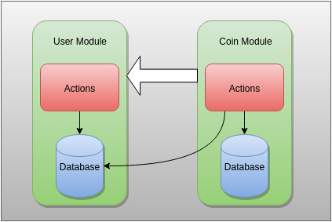

# Tutorials

**Main thread**

- [Basic Tutorial](#basic-tutorial)
- [Advanced Tutorial](#advanced-tutorial)

**Specific**

- [Actions and Database Linking](#actions-and-database-linking)

## Basic Tutorial

This tutorial shows how to use the dao framework. We're going to start by looking at a regular, simple contract; namely the subcurrency example from the [Solidity webpage](http://solidity.readthedocs.org/en/latest/introduction-to-smart-contracts.html#subcurrency-example). This is how it looks at the time of writing:

```
contract Coin {

    // The keyword "public" makes those variables
    // readable from outside.
    address public minter;
    mapping (address => uint) public balances;

    // Events allow light clients to react on
    // changes efficiently.
    event Sent(address from, address to, uint amount);

    // This is the constructor whose code is
    // run only when the contract is created.
    function Coin() {
        minter = msg.sender;
    }

    function mint(address receiver, uint amount) {
        if (msg.sender != minter) return;
        balances[receiver] += amount;
    }

    function send(address receiver, uint amount) {
        if (balances[msg.sender] < amount) return;
        balances[msg.sender] -= amount;
        balances[receiver] += amount;
        Sent(msg.sender, receiver, amount);
    }

}
```

This contract has all the basic functionality needed for a subcurrency contract, but it is not fit for the dao framework. We need to separate it into a database and an actions contract.

### Step 1

The first step is to create a database and an actions contract. We will leave the database empty for now, and put everything into the actions contract. 

We will make a few modifications first. 

- The event is not needed for this example, so it will be removed. 

- Sticking to the coding conventions we will remove the public modifier from `minter` and write the accessor function ourselves so that we can document it and name the return value. We will also put a `_` in front of the variable name since it's not public. This helps us avoid name collisions with functions, and signals to other ÐApp Ðevs that they should never access the variable directly. 

- We will do the same thing as above with the `balances` field.

- We will add return values to all functions, so that callers knows what's going on. These are standard errors so the errors in dao-core's `Errors.sol` will do. NOTE: Ethereum itself does not support return values from transactions yet, but others (like Tendermint) do, and it's planned for Ethereum as well.

- We will make the minter address a constructor argument instead of automatically assigning `msg.sender`.

```
contract CoinDb is Database {

}
```

```
contract CoinActions is DefaultDougEnabled, Errors {
    
    address _minter;
    mapping (address => uint) _balances;

    function CoinActions(address minter) {
        _minter = minter;
    }
    
    function mint(address receiver, uint amount) returns (uint16 error) {
        if (msg.sender != _minter) {
            return ACCESS_DENIED;
        }
        _balances[receiver] += amount;
    }
    
    function send(address receiver, uint amount) returns (uint16 error) {
        if (_balances[msg.sender] < amount) {
            return INSUFFICIENT_SENDER_BALANCE;
        }
        _balances[msg.sender] -= amount;
        _balances[receiver] += amount;
    }
    
    function minter() constant returns (address minter){
        return _minter;
    }
    
    function accountBalance(address addr) constant returns (uint balance){
        return _balances[addr];
    }
    
}
```

### Step 2

The next step is to separate logic from data storage. User permission checks in the DAO framework are always done in actions contracts.

```

contract CoinDb is Database, Errors {
    
    mapping (address => uint) _balances;

    function add(address receiver, uint amount) returns (uint16 error) {
        if(!_checkCaller()){
            return ACCESS_DENIED;
        }
        _balances[receiver] += amount;
    }
    
    function send(address sender, address receiver, uint amount) returns (uint16 error) {
        if(!_checkCaller()){
            return ACCESS_DENIED;
        }
        if (_balances[sender] < amount) {
            return INSUFFICIENT_SENDER_BALANCE;
        }
        _balances[sender] -= amount;
        _balances[receiver] += amount;
    }
    
    function accountBalance(address addr) constant returns (uint balance){
        return _balances[addr];
    }
    
    function destroy(address fundReceiver){}
    
}
```

```
contract CoinActions is DefaultDougEnabled, Errors {
    
    address _minter;
    
    CoinDb _cdb;
    
    function CoinActions(address coinDb, address minter){
        _cdb = CoinDb(coinDb);
        _minter = minter;
    }
        
    function mint(address receiver, uint amount) returns (uint16 error) {
        if (msg.sender != _minter) {
            return ACCESS_DENIED;
        }
        return _cdb.add(receiver, amount);
    }
    
    function send(address receiver, uint amount) returns (uint16 error) {
        return _cdb.send(msg.sender, receiver, amount);
    }
    
    function minter() constant returns (address minter){
        return _minter;
    }
    
    function destroy(address fundReceiver){}
    
}
```

We have now lifted the `minter` mechanics out of the database contract and put it in the actions contract instead. Minting is restricted to a single account for now, but if we wanted to add minting privileges to more then one account we can now do that by replacing the action contract; the coin balances of all users would still remain in the database, un-changed.

The database contract only has a simple mapping in it, but in a real system we would probably want a more advanced collection, so there would be a lot more code in there (or it would delegate some of that functionality to a library contract).

Note that the actions contract takes the coin database contract address as a constructor argument. We will look at a number of different ways of doing this in another tutorial.

### Step 3

We now have to deploy the system and test it. We will do that through the browser compiler, to make it as simple as possible. Note that the test contract is now the minter and the sender - not us.

```
contract UserProxy {

    function mint(address coinActions, address receiver, uint amount) returns (uint16 error){
        error = CoinActions(coinActions).mint(receiver,amount);
    }
    
    function send(address coinActions, address receiver, uint amount) returns (uint16 error){
        error = CoinActions(coinActions).send(receiver,amount);
    }
}

contract CoinTest {
    
    Doug _doug;
    UserProxy _proxy;
    
    function CoinTest(){
        _doug = new DefaultDoug(new DefaultPermission(address(this)), false, false);
        var cdb = new CoinDb();
        _doug.addDatabaseContract("minted_coin", cdb);
        var ca = new CoinActions(cdb, this);
        _doug.addActionsContract("minted_coin", ca);
        _proxy = new UserProxy();
    }
    
    function mint(address receiver, uint amount) returns (uint16){
        return CoinActions(_doug.actionsContractAddress("minted_coin")).mint(receiver,amount);
    }
    
    function send(address receiver, uint amount) returns (uint16){
         return CoinActions(_doug.actionsContractAddress("minted_coin")).send(receiver,amount);
    }
    
    function mintAsProxy(address receiver, uint amount) returns (uint16){
        return _proxy.mint(_doug.actionsContractAddress("minted_coin"), receiver, amount);
    }
    
    function sendAsProxy(address receiver, uint amount) returns (uint16){
         return _proxy.send(_doug.actionsContractAddress("minted_coin"), receiver, amount);
    }
    
    function balance(address addr) constant returns (uint) {
        return CoinDb(_doug.databaseContractAddress("minted_coin")).accountBalance(addr);
    }
    
    function myAddress() constant returns (address){
        return address(this);
    }
        
    function proxyAddress() constant returns (address){
        return address(_proxy);
    }
    
}
```

What we did here was to set the system up so that we call it from a solidity contract. This is just to make testing simpler. In a normal system, this would be done from a custom web-page or a server (through RPC calls to the ethereum client).

You may run this yourself by clicking this link: https://chriseth.github.io/browser-solidity/?gist=https://gist.github.com/anonymous/55740f9702fbf082c5a3

WARNING: It will take a while to load the page and compile.

After loaded, find `CoinTest` in the menu to the right, click `create`, and then play around with the methods.

## Advanced Tutorial

This tutorial builds on the basic tutorial, where we created and deployed a sub-currency using the DAO framework. We are now going to add a user management system that will work together with the currency. Users will no longer be able to just get and transfer money around, but will have to be identified first. 

There are two ways to go about this; one is to add a set of administrators that will vet users off-chain before they add them to the system. It could also be made so that users can register themselves automatically. We will start with the automatic approach, and add a simple user manager that lets people register their account along with a (unique) nickname.

```
contract UserDb is Database, Errors {

    mapping (address => bytes32) _usersByAddress;
    mapping (bytes32 => address) _usersByName;
    
    function register(address addr, bytes32 name) returns (uint16 error) {
        if(!_checkCaller()){
            return ACCESS_DENIED;
        }
        if(_usersByAddress[addr] != 0 || _usersByName[name] != 0){
            return RESOURCE_ALREADY_EXISTS;
        }
        _usersByAddress[addr] = name;
        _usersByName[name] = addr;
    }
    
    function deregister(address addr) returns (uint16 error) {
        if(!_checkCaller()){
            return ACCESS_DENIED;
        }
        if(_usersByAddress[addr] == 0){
            return RESOURCE_NOT_FOUND;
        }
        _usersByAddress[addr] = name;
        _usersByName[name] = addr;
    }
    
    function userAddress(bytes32 name) constant returns (address userAddress){
        return _usersByName[name];
    }
    
    function userName(address addr) constant returns (bytes32 name){
        return _usersByAddress[addr];
    }
    
    function usersExist(address user1, address user2) constant returns (bool user1Exists, bool user2Exists){
        user1Exists = _usersByAddress[user1] != 0;
        user2Exists = _usersByAddress[user2] != 0;
    }
    
}

```

```
contract UserActions is DefaultDougEnabled, Errors {
    
    address _admin;
    
    UserDb _udb;
    
    function UserActions(address userDb, address admin){
        _udb = UserDb(coinDb);
        _admin = admin;
    }
        
    function register(bytes32 name) returns (uint16 error) {
        if(name == null){
            return NULL_PARAM_NOT_ALLOWED;
        }
        return _udb.register(msg.sender, name);
    }
    
    function deregister() returns (uint16 error) {
        return _udb.deregister(msg.sender);
    }
    
    function deregister(address addr) returns (uint16 error) {
        if(addr != msg.sender && msg.sender != _admin){
            return ACCESS_DENIED;
        }
        return _udb.deregister(addr);
    }
        
    function admin() constant returns (address admin){
        return _admin;
    }
    
}
```

This module is very basic. It lets actions-contracts register and deregister users. Note that some input validation is done in the actions contract and some in the database. The rule of thumb is that if the validation requires data from the database (such as checking if a user is already registered), it is best done there.

There are two methods for de-registering users, one that takes no parameter and defaults to `msg.sender`, and another one that takes the address as a param. The second one is for adminstrators who wants to remove users that perhaps has an inappropriate name, or that needs to be removed for some other reason.

Notice that there is an existence check for a pair of users. The reason is because interaction between two registered users would usually be a common thing, so it's good to have a function for quickly checking existence of two users at once (i.e. without having to do two separate calls). 

### Step 2

Next we're going to modify the old coin actions contract. It will now check if the caller is a registered user before letting them send or receive coins. Good thing the coin actions contract is separate from the database, or we would have had to replace the entire system; now we only have to fix the actions contract and re-deploy.

contract CoinActions is DefaultDougEnabled, Errors {
    
    address _minter;
    
    CoinDb _cdb;
    UserDb _udb;
    
    function CoinActions(address coinDb, address userDb, address minter){
        _cdb = CoinDb(coinDb);
        _udb = UserDb(userDb);
        _minter = minter;
    }
        
    function mint(address receiver, uint amount) returns (uint16 error) {
        if (msg.sender != _minter) {
            return ACCESS_DENIED;
        }
        if(receiver != _minter && _udb.userName(receiver) == 0){
            return RESOURCE_NOT_FOUND;
        }
        return _cdb.add(receiver, amount);
    }
    
    function send(address receiver, uint amount) returns (uint16 error) {
        var (sE, rE) = _udb.usersExist(msg.sender, receiver);
        if(!(sE && rE)){
            return RESOURCE_NOT_FOUND;
        }
        return _cdb.send(msg.sender, receiver, amount);
    }
    
    function minter() constant returns (address minter){
        return _minter;
    }
    
}

The sub-currency module now depends on the user module, because it calls on the user database to do checks before any coins can be minted or transferred.



Note that the minter does not have to be a user, so the user check in the mint method needs to take that into account (hence the first condition).

It would now be possible to deploy this just as any other contracts.

### Step 3 (optional)

Before we go on to test this, we will consider the performance impact of this setup. Let's start by analyzing the call-chain when someone invokes 'send'. It would look like this.

1. User calls Coin actions
2. Coin actions calls user database (to do user existence check)
3. Coin actions calls coin database (to alter the balances)
4. Coin database calls DOUG (to check if caller is an actions contract)

This means every time a user wants to transfer coins, three contract-to-contract calls will be made. That in itself is not that bad, because a call costs only 40 gas as of now (2016-01-11), but it also involves packing and sending data back and forth so will probably add at least 1000 gas or so to the total. What we could do is to merge steps 2 and 3 by combining the user and coin databases into one, but that is not completely without risk. 

If all we do is combine the two databases so one could check if a user is registered and what their coin balance is at the same time, then that wouldn't be so bad. That's just an accessor function, and if at some point we want to decouple the two components we can still do that - just stop doing that function in actions contracts. 

If want to automatically check user status **when writing**, i.e. as part of the send function in the database contract, then we're stuck with it until we choose to replace the entire database because that would be the only way to change it back.

This is a good example of why the separation is important. Not having it could lead to hard problems. Maybe in some systems it's worth saving a few hundred gas by lumping everything together, but generally that is not the case. At least not in my experience. A send here involves a transaction plus the altering of two storage slots, and only that costs at least 31000 (21k for tx and 5k per storage slot manipulation). 

A better solution could be to allow bulk operations (through arrays), like checking X users, and doing X sends at once. The memory used for that is cheap, and would make sends cost less on average.

## Actions and Database Linking

There are several ways in which actions contracts and database contracts can be linked. In the basic and advanced tutorials they are linked by passing the address to the database in the constructor of the actions contract.

```
function CoinActions(address coinDb, address minter){
        _cdb = CoinDb(coinDb);
        _minter = minter;
    }
```

Calls to the database are done using the `_cdb` variable.

```
function send(address receiver, uint amount) returns (uint16 error) {
    return _cdb.send(msg.sender, receiver, amount);
}
```

This is fast and simple, but there is a problem. What if we want to replace the database? In that case we will have to add a method to the actions contract that allow us to change the database address, and remember to do that when we add a new database.

The setter will have to use permissions as well. One way of doing it would be to allow anyone with the Doug permission to do it.
 
```
function setCoinDb(address newCoinDb) returns (uint16 error) {
    var perm = Permission(_DOUG.permissionAddress());
    if(!perm.hasPermission(msg.sender)){
        return ACCESS_DENIED;
    }
    _cdb = CoinDb(newCoinDb);
    return NO_ERROR;
}
```

Another alternative is to fetch the current database in every call through Doug. All contracts in the system has a reference to Doug, which makes it possible to check the contract registries and permission root/owners. 

```
function mint(address receiver, uint amount) returns (uint16 error) {
    if (msg.sender != _minter) {
        return ACCESS_DENIED;
    }
    var coinDb = CoinDb(_DOUG.databaseContractAddress("minted_coin"));
    return coinDb.add(receiver, amount);
}
```

This means we can be sure it will always use the latest database, and that we don't have to update manually when changing it. The drawback is that this requires both an additional contract call + Doug has to reach into its iterable map to check, so it adds a small gas overhead to each call. It also can cause issues if the name of the database changes.
 
 Finally, replacing databases should not happen very often. That is one of the main reasons for using database contracts to begin with. It's far more likely that an actions contract would change, since they have all of the application specific logic, but the same principle would apply there (i.e. actions calling other actions).