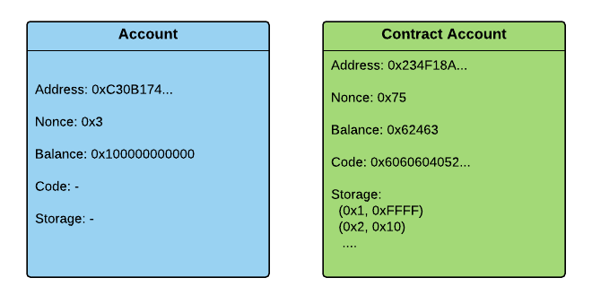

# Updating Solidity 1 - Contract basics

This is a new tutorial series about how to create modular systems of smart-contracts, and how to replace contracts in a reliable way. This, along with some other life-cycle management, is mostly what this DAO framework does.
 
Readers should have a basic understanding of how Ethereum and Solidity works.

### Updating contracts

Most contracts in a DApp will become obsolete at some point, and will require an update. Same as in other applications. It could be because new features must be added, a bug is found, or because a better, more optimized version has been made. Updating could of course cause problems so it must be done with care. Some of the things one must ensure is that:

- the new contract works as intended.
- all the calls made during the replacement procedure was executed successfully.
- replacing the contract has no side-effects in other parts of the system.

The first thing that must be checked, though, is that updating is even possible at all. This is not always the case, because of how Ethereum accounts works.

### Accounts, Code and Storage

A very important property of Etheruem contracts is that when a contract has been uploaded to the chain, the code can never be changed. Contracts are stored in special account objects that hold references to the contract (byte) code, and a database, and some other things. The database is a key-value store, also known as 'storage', and is where data such as the values of contract fields is stored.



When contracts are created, a new account is first made, then the code is loaded into a VM which runs the constructor part, initializes fields etc., and then adds the runtime portion (or body) of the contract to the account. After that is done, there is no way to change the code, and there is no way to update the database except through that code.

### Writing modular contracts

Writing modular contracts is not that complicated. We will start from the beginning, and make something very simple:

```
contract Data {

    uint public data;

    function addData(uint data_) {
        if(msg.sender == 0x692a70d2e424a56d2c6c27aa97d1a86395877b3a)
            data = data_;
    }
    
}
```

This contract allows a user to add and read an unsigned integer. The only account that is allowed to add data is the account with address `0x692a...`. This address is a hex literal, so is added to the bytecode when the contract is compiled.

A potential problem is that we might want to replace this address later, or even the entire validation procedure, but we can't because of how code and storage works. A simple way of making the contract more flexible is to store the current owner address in storage instead, and make it possible to change.

```
contract DataOwnerSettable {
    
    uint public data;
    
    address public owner = msg.sender;

    function addData(uint data_) {
        if(msg.sender == owner)
            data = data_;
    }
    
    function setOwner(address owner_) {
        if(msg.sender == owner)
            owner = owner_;
    }
    
}
```

This contract has an `owner` field (mapped to storage). It is initialized with the address of the account that creates the contract, and can later be changed by the current owner by calling `setOwner`. The guard inside `addData` is still the same; the only thing that changed is that the owner address is no longer hard-coded.

### Delegation

What if a settable owner is not enough, though? What if we want to be able to update not only the owner address, but the entire validation process?

There is actually a way to replace code, and that is by connecting several contract calls ro form one single call-chain. A contract `C` could call another contract `C` as part of its functionality, meaning a transaction to `C` will execute code not just in `C` but in `D` as well. Moreover, we could also make the address to `D` settable, meaning it would be possible to change the instance of `D` that `C` is pointing to. An example of this could be a bank contract that calls a different contract to authenticate.


In this case, every time `deposit` is called on `Bank`, it makes a call to `Authenticator`, using the caller address as argument, and checks the return value to decide whether or not to break. `Authenticator` is just another contract, and it is possible to change the address to the `Authenticator` meaning the calls would be directed to another contract. 

We're now going to update the data contract to work in this way, starting by moving the account validation into a different contract.

```
contract AccountValidator {
    
    address public owner = msg.sender;
    
    function validate(address addr) constant returns (bool) {
        return addr == owner;
    }
    
    function setOwner(address owner_) {
        if(msg.sender == owner)
           owner = owner_;
    }
    
}


contract DataExternalValidation {
    
    uint public data;

    AccountValidator _validator;

    function DataExternalValidation(address validator) {
        _validator = AccountValidator(validator);
    }

    function addData(uint data_) {
        if(_validator.validate(msg.sender))
            data = data_;
    }
    
    function setValidator(address validator) {
        if(_validator.validate(msg.sender))
            _validator = AccountValidator(validator);
    }
}
```

To use this, we first create an `AccountValidator` contract; it has the `owner` field now, and that field is automatically initialized with an account address. Then we create a `DataExternalValidation`-contract and inject the address of the validator through the contract constructor. When someone tries to write to `data`, it will call the `validate` function of the current validator contract to do the check rather then storing (or hard coding) the `owner` address and doing the equality check internally. Everything that has to do with access control is now delegated to the validator contract. 

This is very nice, because it is now possible to replace the contract that does the actual check. Also, since the `AccountValidator` is its own contract we could potentially use that contract in other contracts as well, and thus use it to control more contracts then just one.

One thing remains though. We still can't replace the code! All we have done is move the validation code out of the contract. The code of the `AccountValidator` contract can't be changed anymore then that of the data contract. Fortunately, Solidity provides a very simple and powerful workaround - abstract functions. 

### Abstract functions

Using abstract functions, the validator contract could be changed into this:

```
contract AccountValidator {
    function validate(address addr) constant returns (bool);
}


contract SingleAccountValidator is AccountValidator {
    
    address public owner = msg.sender;
    
    function validate(address addr) constant returns (bool) {
        return addr == owner;
    }
    
    function setOwner(address owner_) {
        if(msg.sender == owner)
            owner = owner_;
    }
    
}
```

With these contracts, the data contract no longer works with a concrete validator contract, but an abstract (interface) representation. This makes sense, because it does not really needs to know what the `validate` function actually does, it only needs to know the signature.

Interfaces works the same way as it does in most other object-oriented languages, just declare functions without a body and they become abstract. 

We still can't change the code stored in a contract account, but we can change the code that is executed when a function is called, by delegating some functionality to other contract which are allowed to be replaced; all we need to do is change the validator contract to a different contract. For example, if we want to allow more owners then one we could use an instance of this contract:

```
contract MultiAccountValidator is AccountValidator {
    
    mapping(address => bool) public owners;
    
    function MultiAccountValidator() {
        owners[msg.sender] = true;
    }
    
    function validate(address addr) constant returns (bool) {
        return owners[addr];
    }
    
    function addOwner(address addr) {
        if(owners[msg.sender])
            owners[addr] = true;
    }
}
```

Finally, it is worth noticing that you can actually pass in a contract that is not an `AccountValidator`. There is no type check when you convert an address to a contract type, so it would only show up when the contract is actually called; and in fact, if the contract has the required method it will work, even though it does not actually actually extend `AccountValidator`, but even though it works it is of course not recommended to use contracts in that way. 

### Summary

Proper delegation is an important part of smart-contract systems, because it means contracts can be replaced. There are some things to keep in mind, though:  

- Delegation requires type-unsafe conversion, which means one must be careful when setting/changing a contract reference.

- The more contracts that are in the system the harder they become to manage, and a strategy that makes a small system work may not be suitable for a medium-sized or large one.

- Modularity comes with a cost, because it requires more code, storage variables and calls. On the public chain, where the gas limitations are quite severe (for obvious reasons), even a small modular system could be hard to deploy and run. Generally, when it comes to scalability vs. efficiency I tend to go with scalability. The large, expensive contracts in an excessively modular system can after all be improved and replaced, but if the contracts are locked down that may not be an option.

### Next tutorial

The next tutorial will be about how the external components can be set up so as to make the updating process safe. This will include contract code compilation, testing, and how to get contracts onto the chain using web3.js - the official Ethereum javascript API.


Happy smart-contracting! 

// A